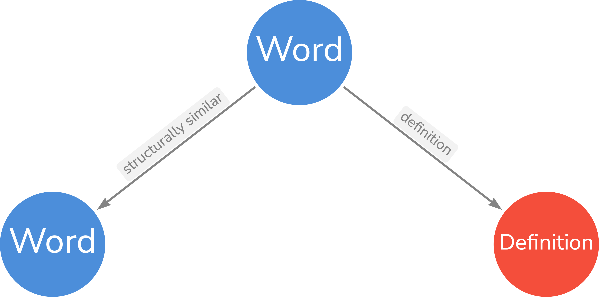

Wiktionary Data on Hugging Face Datasets
========================================

[![Hugging Face dataset badge]][Hugging Face dataset URL]

![Python Version Badge]
[![GitHub workflow status badge][GitHub workflow status badge]][GitHub workflow status URL]
[![Hugging Face sync status badge]][Hugging Face sync status URL]
[![Apache License Badge]][Apache License, Version 2.0]

[wiktionary-data]() is a sub-data extraction of the [English Wiktionary](https://en.wiktionary.org) that currently
supports the following languages:

- __Deutsch__ - German
- __Latinum__ - Latin
- __Ἑλληνική__ - Ancient Greek
- __한국어__ - Korean
- __𐎠𐎼𐎹__ - [Old Persian](https://en.wikipedia.org/wiki/Old_Persian_cuneiform)
- __𒀝𒅗𒁺𒌑(𒌝)__ - [Akkadian](https://en.wikipedia.org/wiki/Akkadian_language)
- [Elamite](https://en.wikipedia.org/wiki/Elamite_language)
- __संस्कृतम्__ - Sanskrit, or Classical Sanskrit

[wiktionary-data]() was originally a sub-module of [wilhelm-graphdb](https://github.com/QubitPi/wilhelm-graphdb). While
the dataset it's getting bigger, I noticed a wave of more exciting potentials this dataset can bring about that
stretches beyond the scope of the containing project. Therefore I decided to promote it to a dedicated module; and here
comes this repo.

The Wiktionary language data is available on 🤗 [Hugging Face Datasets][Hugging Face dataset URL].

```python
from datasets import load_dataset
dataset = load_dataset("QubitPi/wiktionary-data")
```

There are __two__ data subsets:

1. __Languages__ subset that contains extraction of a subset of supported languages:

   ```console
   dataset = load_dataset("QubitPi/wiktionary-data", "Wiktionary")
   ```
   
   The subset contains the following splits

   - `German`
   - `Latin`
   - `AncientGreek`
   - `Korean`
   - `OldPersian`
   - `Akkadian`
   - `Elamite`
   - `Sanskrit`

2. __Graph__ subset that is useful for constructing knowledge graphs:

   ```console
   dataset = load_dataset("QubitPi/wiktionary-data", "Knowledge Graph")
   ```
   
   The subset contains the following splits

   - `AllLanguage`: all the languages listed above in a giant graph

   The _Graph_ data ontology is the following:

   <div align="center">
       
   </div>

> [!TIP]
>
> Two words are structurally similar if and only if the two shares the same
> [stem](https://en.wikipedia.org/wiki/Word_stem)

Development
-----------

### Data Source

Although [the original Wiktionary dump](https://dumps.wikimedia.org/) is available, parsing it from scratch involves
rather complicated process. For example,
[acquiring the inflection data of most Indo-European languages on Wiktionary has already triggered some research-level efforts](https://stackoverflow.com/a/62977327).
We would probably do it in the future. At present, however, we would simply take the awesome works by
[tatuylonen](https://github.com/tatuylonen/wiktextract) which has already processed it and presented it in
[in JSONL format](https://kaikki.org/dictionary/rawdata.html). wiktionary-data sources the data from
__raw Wiktextract data (JSONL, one object per line)__ option there.

### Environment Setup

Get the source code:

```console
git clone git@github.com:QubitPi/wiktionary-data.git
cd wiktionary-data
```

It is strongly recommended to work in an isolated environment. Install virtualenv and create an isolated Python
environment by

```console
python3 -m pip install --user -U virtualenv
python3 -m virtualenv .venv
```

To activate this environment:

```console
source .venv/bin/activate
```

or, on Windows

```console
./venv\Scripts\activate
```

> [!TIP]
> 
> To deactivate this environment, use
> 
> ```console
> deactivate
> ```

### Installing Dependencies

```console
pip3 install -r requirements.txt
```

License
-------

The use and distribution terms for [wiktionary-data]() are covered by the [Apache License, Version 2.0].

[Apache License Badge]: https://img.shields.io/badge/Apache%202.0-F25910.svg?style=for-the-badge&logo=Apache&logoColor=white
[Apache License, Version 2.0]: https://www.apache.org/licenses/LICENSE-2.0

[GitHub workflow status badge]: https://img.shields.io/github/actions/workflow/status/QubitPi/wiktionary-data/ci-cd.yaml?branch=master&style=for-the-badge&logo=github&logoColor=white&label=CI/CD
[GitHub workflow status URL]: https://github.com/QubitPi/wiktionary-data/actions/workflows/ci-cd.yaml

[Hugging Face dataset badge]: https://img.shields.io/badge/Hugging%20Face%20Dataset-wiktionary--data-FF9D00?style=for-the-badge&logo=huggingface&logoColor=white&labelColor=6B7280
[Hugging Face dataset URL]: https://huggingface.co/datasets/QubitPi/wiktionary-data

[Hugging Face sync status badge]: https://img.shields.io/github/actions/workflow/status/QubitPi/wiktionary-data/ci-cd.yaml?branch=master&style=for-the-badge&logo=github&logoColor=white&label=Hugging%20Face%20Sync%20Up
[Hugging Face sync status URL]: https://github.com/QubitPi/wiktionary-data/actions/workflows/ci-cd.yaml

[Python Version Badge]: https://img.shields.io/badge/Python-3.10-FFD845?labelColor=498ABC&style=for-the-badge&logo=python&logoColor=white
